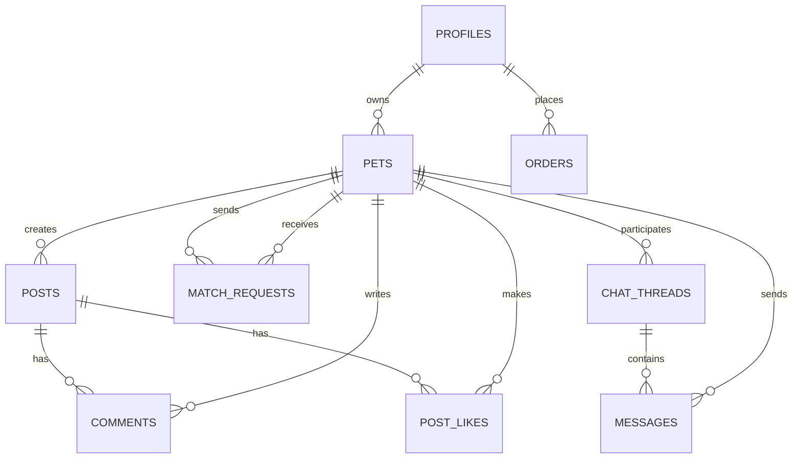
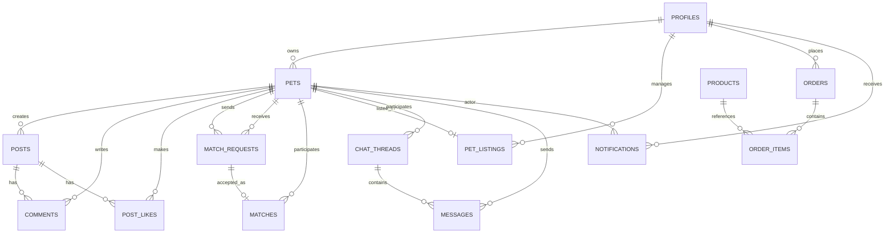

# PetSphere (pet_dating_app) — Codebase Analysis

> Scope: static analysis of the current Flutter/Dart code under `lib/**` plus key root config files. This report is based on what is *present in the repository right now*.

## Table of contents

- [Executive overview](#executive-overview)
- [Tech stack](#tech-stack)
- [Architecture & code organization](#architecture--code-organization)
- [Implemented features (and what’s stubbed)](#implemented-features-and-whats-stubbed)
- [Inferred database schema (Supabase/Postgres)](#inferred-database-schema-supabasepostgres)
- [Storage buckets](#storage-buckets)
- [ERD (Mermaid)](#erd-mermaid)
- [File-by-file walkthrough (`lib/**`)](#file-by-file-walkthrough-lib)
- [Notable risks, bugs, and improvement opportunities](#notable-risks-bugs-and-improvement-opportunities)
- [Suggested next steps / backlog](#suggested-next-steps--backlog)

## Executive overview

PetSphere is a Flutter app that combines:

- **Social feed**: pets can create posts with media + captions; users can like and comment.
- **Matchmaking**: pets can discover other pets, send match requests, and accept/decline incoming requests.
- **Chat**: matched pets can chat in real time (Supabase Realtime Postgres Changes).
- **Marketplace**: browse products, add to a **local** cart, and (in data layer) place orders.

The app follows a clean-ish layering:

**Views (UI)** → **Controllers (Riverpod Notifiers)** → **Repositories** → **Supabase (Auth + PostgREST + Storage + Realtime)**

A key architectural concept is **“active pet context”**: many actions (like/comment/chat/match) are executed as the currently selected pet (`activePetProvider`).

## Tech stack

From `pubspec.yaml`:

- **Dart SDK**: `^3.11.4`
- **Flutter**: via SDK
- **State management**: `flutter_riverpod ^3.3.1` (Notifier-based)
- **Routing**: `go_router ^17.1.0`
- **Backend**: `supabase_flutter ^2.8.4`
  - Auth (email/password)
  - Database access via PostgREST (`supabase.from('table')...`)
  - Storage uploads (public URLs)
  - Realtime subscriptions (`onPostgresChanges`)
- **Media**: `image_picker ^1.1.2`
- **UI**: Material 3 + `google_fonts ^8.0.2`
- **Formatting**: `intl ^0.20.2` (currency formatting)
- **Linting**: `flutter_lints` via `analysis_options.yaml`

## Architecture & code organization

### Folder layout

- `lib/main.dart`: Supabase initialization + app bootstrap
- `lib/utils/`: routing, Supabase config, upload helper
- `lib/theme/`: app theme
- `lib/models/`: immutable-ish data models
- `lib/repositories/`: Supabase data access (tables/joins/Storage/Realtime)
- `lib/controllers/`: Riverpod Notifiers (state + orchestration)
- `lib/views/`: screens
- `lib/views/components/`: reusable UI components

### High-level data flow

```mermaid
flowchart LR
  UI[Views / Widgets] --> C[Controllers (Riverpod Notifiers)]
  C --> R[Repositories]
  R --> S[Supabase: Auth + PostgREST + Storage + Realtime]

  S --> R
  R --> C
  C --> UI
```

### App startup & auth gating

- `lib/main.dart` initializes Supabase via `Supabase.initialize(url: ..., anonKey: ...)`, then starts `MaterialApp.router`.
- `lib/utils/routes.dart` defines routing and **redirect rules** based on `AuthStatus`:
  - `AuthStatus.initial` forces `/splash`.
  - `unauthenticated` forces `/login` (except `/register`).
  - `authenticated` redirects `/login`, `/register`, `/splash` → `/home`.

### “Active pet” context

- `lib/controllers/pet_controller.dart` loads the authenticated user’s pets and sets a default `activePet`.
- `activePetProvider` is used across feed/match/chat to decide **which pet is acting**.

## Implemented features (and what’s stubbed)

### Authentication & profiles

**Implemented**

- Email/password sign-in and sign-up:
  - `lib/views/login_screen.dart`
  - `lib/views/registration_screen.dart`
  - `lib/repositories/auth_repository.dart`
- Creates/updates a profile record in `profiles` table during sign-up.
- Global auth state stream wired into a Riverpod auth notifier:
  - `lib/controllers/auth_controller.dart`

**Gaps / not implemented in UI**

- Password reset, email verification UX, social login.
- Account settings UI exists as an icon/button in places but no implementation.

### Pet profiles

**Data layer implemented**

- CRUD-style access exists in `lib/repositories/pet_repository.dart`.
- Controller support exists in `lib/controllers/pet_controller.dart` (`createPet`, `reload`, `setActivePet`).

**UI status**

- Pet creation UI is now implemented via `CreatePetScreen` and wired from profile “Add Pet” action (`/create_pet`).

### Social feed

**Implemented**

- Feed list with loading/error/empty states: `lib/views/home_screen.dart`.
- Create post (pick image, upload, caption): `lib/views/create_post_screen.dart`.
- Like/unlike: `FeedRepository.toggleLike` + controller optimistic updates.
- Comments: insert into `comments` and display through join.

**Partially implemented / placeholder UX**

- Share sheet now copies post links to clipboard; native OS share integration is still pending.

### Matchmaking

**Implemented**

- Discovery feed excluding self + already requested:
  - `lib/repositories/match_repository.dart` (`fetchDiscoveryPets`)
  - `lib/controllers/match_controller.dart`
  - `lib/views/discovery_screen.dart`
- Send like request (upsert into `match_requests`).
- Notifications screen shows received requests with accept/decline:
  - `lib/views/notifications_screen.dart`

### Notifications

**Implemented**

- Backend notification events now generated from DB triggers (`match accepted`, `new message`, `order status change`).
- App-side notification stack added:
  - `lib/models/notification_model.dart`
  - `lib/repositories/notification_repository.dart`
  - `lib/controllers/notification_controller.dart`
- `NotificationsScreen` now shows both:
  - match requests (actionable accept/decline), and
  - activity feed from `notifications` table with mark-read support.
- Unread notification badge now appears on Home and Discovery notification icons.

**Recently implemented**

- “List Pet” (FAB) now persists to Supabase `pet_listings` through controller/repository wiring.

### Chat

**Implemented**

- Thread listing: `lib/views/messages_list_screen.dart` + `chatProvider`.
- Thread messages: `lib/views/chat_screen.dart` + per-thread message notifier.
- Real-time updates: `ChatRepository.subscribeToMessages` uses `onPostgresChanges(insert)` filtered by `thread_id`.
- Mark thread read: update `messages.is_read` where not sent by current pet.

**Gaps**

- No attachments/media in messages.
- No typing indicators.
- “Unread count” exists in `ChatThreadModel`, but the current thread query doesn’t select an `unread_count` field; it defaults to `0`.

### Marketplace + cart + orders

**Implemented**

- Product browsing: `lib/views/marketplace_screen.dart` + `MarketplaceRepository.fetchProducts`.
- Product details: `lib/views/product_detail_screen.dart`.
- Local cart state with quantity update/remove/clear:
  - `lib/controllers/cart_controller.dart`
  - `lib/views/cart_screen.dart`
- Data-layer “place order” exists:
  - `lib/repositories/marketplace_repository.dart` inserts into `orders` with `items` as JSON and `total`.
  - `CartController.placeOrder()` calls that repository method.

**Recently implemented**

- `CartScreen` checkout now calls `CartController.placeOrder()` with loading/success/error handling and persists order data.

## Inferred database schema (Supabase/Postgres)

This schema is inferred from:

- Models under `lib/models/**`
- Supabase queries under `lib/repositories/**`

Column names below are limited to what is referenced in code.

### `profiles`

Used by `AuthRepository` and `UserModel`.

- `id` (string/uuid) — matches Supabase Auth user id
- `email` (text)
- `name` (text, nullable)
- `profile_image_url` (text, nullable)

### `pets`

Used by `PetRepository` and `PetModel`.

- `id` (string/uuid)
- `user_id` (string/uuid) — owner (FK-ish to `profiles.id`)
- `name` (text)
- `breed` (text)
- `animal_type` (text)
- `age` (int)
- `bio` (text)
- `profile_image_url` (text)
- `images` (text[] or json array)
- `is_public_owner` (bool)
- `created_at` (timestamp) — used for ordering in some queries

### `posts`

Used by `FeedRepository` and `PostModel`.

- `id` (string/uuid)
- `pet_id` (string/uuid) — joins to `pets` (code uses `pets!posts_pet_id_fkey(*)`)
- `media_url` (text)
- `caption` (text)
- `created_at` (timestamp)

### `post_likes`

Used by `FeedRepository.toggleLike`.

- `post_id` (string/uuid) — FK-ish to posts
- `pet_id` (string/uuid) — FK-ish to pets

> Note: the code treats `(post_id, pet_id)` as a unique pair (insert/delete by those columns).

### `comments`

Used by `FeedRepository.addComment` and `CommentModel`.

- `id` (string/uuid)
- `post_id` (string/uuid)
- `pet_id` (string/uuid)
- `text` (text)
- `created_at` (timestamp)

### `match_requests`

Used by `MatchRepository` and `MatchRequestModel`.

- `id` (string/uuid)
- `sender_pet_id` (string/uuid)
- `receiver_pet_id` (string/uuid)
- `status` (text) — expected values in code: `pending`, `matched`, `rejected`
- `created_at` (timestamp)

> Note: code uses `upsert` for a like request, implying a uniqueness constraint should exist (commonly `(sender_pet_id, receiver_pet_id)`).

### `chat_threads`

Used by `ChatRepository` and `ChatThreadModel`.

- `id` (string/uuid)
- `pet_id_1` (string/uuid)
- `pet_id_2` (string/uuid)
- `created_at` (timestamp)

Optional (supported by model but not currently selected in query):

- `updated_at` (timestamp)
- `unread_count` (int)
- `last_message` (json)

### `messages`

Used by `ChatRepository` and `MessageModel`.

- `id` (string/uuid)
- `thread_id` (string/uuid)
- `sender_pet_id` (string/uuid)
- `text` (text)
- `created_at` (timestamp)
- `is_read` (bool)

### `products`

Used by `MarketplaceRepository` and `ProductModel`.

- `id` (string/uuid)
- `name` (text)
- `price` (numeric)
- `vendor_id` (string/uuid or text)
- `description` (text)
- `images` (text[] or json array)
- `stock` (int)
- `category` (text)
- `created_at` (timestamp) — used for ordering

### `orders`

Used by `MarketplaceRepository.placeOrder`.

- `id` (string/uuid) — not referenced but typical
- `user_id` (string/uuid)
- `items` (json/jsonb) — list of `{ product_id, name, quantity, price, subtotal }`
- `total` (numeric)
- `status` (text) — code inserts `pending`

## Storage buckets

Buckets referenced in `lib/utils/supabase_config.dart`:

- `pet-images`
- `post-media`
- `product-images`

Uploads use `upsert: true` (see `ImageUploadHelper.upload`).

## ERD (Mermaid)

> This ERD is inferred from code. It focuses on *relationships implied by joins and inserts*.



## User stories

These are written to reflect what the current codebase supports (✅) and what is implied but not fully wired up yet (⚠️).

### Authentication

- ✅ **As a new user**, I can register with name, email, and password so that I can create an account.
  - Implemented in: `lib/views/registration_screen.dart`, `lib/controllers/auth_controller.dart`, `lib/repositories/auth_repository.dart`.
- ✅ **As a returning user**, I can sign in with email and password so that I can access the app.
  - Implemented in: `lib/views/login_screen.dart`.
- ⚠️ **As a user**, I can reset my password if I forget it.
  - Not currently implemented in UI/data layer.

### Pet onboarding & identity (“act as a pet”)

- ✅ **As an authenticated user**, I can create a pet profile (name, breed, animal type, age, bio, images) so that I can participate socially.
  - Data/controller exist: `PetRepository.createPet`, `PetNotifier.createPet`.
  - Implemented via `CreatePetScreen` + `PetNotifier.createPet(...)`.
- ✅ **As a user with multiple pets**, I can switch the active pet identity so that my actions (posting, liking, matching, chatting) come from the correct pet.
  - Implemented via `PetState.activePet` and `activePetProvider`.

### Feed (posts/likes/comments)

- ✅ **As a pet**, I can create a post with an uploaded photo and a caption so that it appears in the feed.
  - Implemented in: `CreatePostScreen` + `FeedRepository.createPost` (+ storage upload).
- ✅ **As a pet**, I can like/unlike a post so that I can react to content.
  - Implemented in: `FeedRepository.toggleLike`.
- ✅ **As a pet**, I can comment on a post so that I can participate in discussion.
  - Implemented in: `FeedRepository.addComment`.
- ⚠️ **As a pet**, I can share a post link externally.
  - UI exists, but “Copy link” is currently a snackbar-only action.

### Matchmaking

- ✅ **As a pet**, I can browse discovery pets with basic filters (animal type, breed) so that I can find matches.
  - Implemented in: `DiscoveryScreen` + `MatchRepository.fetchDiscoveryPets`.
- ✅ **As a pet**, I can send a match request to another pet so that they can accept or decline.
  - Implemented in: `MatchRepository.sendLikeRequest`.
- ✅ **As a pet**, I can see incoming match requests and accept/decline them.
  - Implemented in: `NotificationsScreen` + `MatchRepository.updateRequestStatus`.
- ✅ **As a pet owner**, I can “list” one of my pets into the matchmaking pool.
  - Implemented with persistence to `pet_listings`.

### Chat

- ✅ **As a pet**, I can open a chat thread with another pet and send/receive messages in real time.
  - Implemented via `ChatRepository` + realtime subscription.
- ✅ **As a pet**, I can see a list of my chat threads.
  - Implemented in: `MessagesListScreen`.

### Marketplace & orders

- ✅ **As a user**, I can browse products and filter by category.
  - Implemented in: `MarketplaceScreen`.
- ✅ **As a user**, I can add products to a cart and adjust quantities.
  - Implemented in: `CartController` + `CartScreen`.
- ✅ **As a user**, I can checkout and have my order saved.
  - Implemented in `CartScreen` + `CartController.placeOrder` + `MarketplaceRepository.placeOrder`.

## File-by-file walkthrough (`lib/**`)

This section lists **every Dart file** and what it does.

### Entry

- `lib/main.dart` — initializes Supabase and starts the app (`MaterialApp.router`) inside Riverpod `ProviderScope`.

### Utils

- `lib/utils/routes.dart` — GoRouter route table + redirect logic based on auth state (`/splash`, `/login`, `/register`, `/home`, `/create_post`, `/create_pet`, `/notifications`, `/pet/:id`, `/messages`, `/chat/:threadId`, `/cart`, `/product/:id`).
- `lib/utils/supabase_config.dart` — Supabase URL/anon key constants + `supabase` client getter + bucket name constants.
- `lib/utils/image_upload_helper.dart` — image picking (camera/gallery) + Supabase Storage upload helpers.

### Theme

- `lib/theme/app_theme.dart` — Material 3 theme setup.

### Models

- `lib/models/user_model.dart` — user profile representation (id/email/name/profile_image_url).
- `lib/models/pet_model.dart` — pet profile representation + `toJson/fromJson` mapping.
- `lib/models/post_model.dart` — post + comment models; expects Supabase join shapes for pet/likes/comments.
- `lib/models/message_model.dart` — chat message model.
- `lib/models/match_request_model.dart` — match request model with optional joined `sender_pets`.
- `lib/models/chat_thread_model.dart` — chat thread model with participant pet ids/pets and optional last message/unread count.
- `lib/models/product_model.dart` — marketplace product model.
- `lib/models/cart_item_model.dart` — local cart line item model.
- `lib/models/notification_model.dart` — app notification model mapped from `notifications` table.

### Repositories (Supabase data access)

- `lib/repositories/auth_repository.dart` — Supabase Auth sign-in/sign-up/sign-out + profile upsert/fetch in `profiles`.
- `lib/repositories/pet_repository.dart` — CRUD for `pets` + Storage uploads to `pet-images`.
- `lib/repositories/feed_repository.dart` — reads/writes `posts`, `post_likes`, `comments` + Storage uploads to `post-media`.
- `lib/repositories/match_repository.dart` — discovery query + match request flow in `match_requests`.
- `lib/repositories/chat_repository.dart` — `chat_threads` + `messages` + realtime subscription for inserts.
- `lib/repositories/marketplace_repository.dart` — fetch `products` and insert `orders`.
- `lib/repositories/notification_repository.dart` — fetch/mark/subscribe user notifications.

### Controllers (Riverpod state + orchestration)

- `lib/controllers/auth_controller.dart` — central auth state (`AuthNotifier`) and `authProvider`.
- `lib/controllers/pet_controller.dart` — loads “my pets”, tracks `activePet`, exposes `petProvider` and `activePetProvider`.
- `lib/controllers/feed_controller.dart` — loads feed, adds posts, toggles likes, adds comments.
- `lib/controllers/match_controller.dart` — loads discovery pets + match requests; applies animal/breed filters.
- `lib/controllers/chat_controller.dart` — threads + per-thread message notifier and realtime lifecycle.
- `lib/controllers/marketplace_controller.dart` — loads products and filters by category.
- `lib/controllers/cart_controller.dart` — local cart state + checkout orchestration (`placeOrder()`).
- `lib/controllers/notification_controller.dart` — notification list/unread count state + realtime subscription lifecycle.

### Views (screens)

- `lib/views/splash_screen.dart` — splash/loading UI.
- `lib/views/login_screen.dart` — login form.
- `lib/views/registration_screen.dart` — sign-up form.
- `lib/views/create_pet_screen.dart` — pet creation form (name/breed/type/age/bio/image URL).
- `lib/views/main_layout.dart` — bottom navigation scaffold (Home/Discover/Create/Shop/Profile).
- `lib/views/home_screen.dart` — feed list + comment/share sheets.
- `lib/views/create_post_screen.dart` — pick image + upload + caption + create post.
- `lib/views/discovery_screen.dart` — discovery grid + animal/breed filters; “List Pet” bottom sheet persists listing state.
- `lib/views/notifications_screen.dart` — match requests inbox (accept/decline).
- `lib/views/match_pet_profile_screen.dart` — details page for a discovered pet.
- `lib/views/messages_list_screen.dart` — list of chat threads.
- `lib/views/chat_screen.dart` — thread messages + composer; realtime updates.
- `lib/views/marketplace_screen.dart` — product grid + filters + cart icon.
- `lib/views/product_detail_screen.dart` — product detail + add to cart.
- `lib/views/cart_screen.dart` — cart review + totals + checkout with persisted order placement.
- `lib/views/pet_profile_screen.dart` — profile for owner vs specific pet; shows post grid.

### View components

- `lib/views/components/post_card.dart` — feed post UI with like/comment/share affordances.
- `lib/views/components/pet_avatar.dart` — circular avatar (optionally with story ring).
- `lib/views/components/match_pet_card.dart` — discovery pet card UI.
- `lib/views/components/chat_thread_tile.dart` — thread list tile with unread badge.
- `lib/views/components/message_bubble.dart` — simple chat bubble.
- `lib/views/components/product_card.dart` — product card UI.
- `lib/views/components/cart_item_tile.dart` — cart row with +/- quantity.

## Notable risks, bugs, and improvement opportunities

### Security / configuration

- **Hardcoded Supabase config**: `lib/utils/supabase_config.dart` contains the Supabase URL and anon key. While the anon key is not as sensitive as a service-role key, it is still best practice to load config via environment/build-time defines.
- App now supports compile-time environment injection via `--dart-define-from-file=.env` with fallback values.

### UI-to-data wiring gaps

- Native OS share sheet integration (beyond clipboard copy) is still pending.
- Account settings/edit flows are still placeholders in profile screen.

### Crash/edge-case risks

- Notification action routing is currently read-only; tapping activity items marks read but does not deep-link to destination entities yet.
- Chat model/query still has partial support for unread metadata and no message attachment path in UI.

### Analyzer notes (from `flutter analyze`)

- Current status: **No issues found**.

### Data modeling notes

- `orders.items` is stored as JSON. This is convenient but makes querying order line items harder than a normalized `order_items` table.

## Suggested next steps / backlog

1. **Share implementation**: add native OS share sheet integration (clipboard copy is now implemented).
2. **Profile settings**: implement edit account/profile flows currently shown as placeholders.
3. **Chat UX polish**: add message timestamps/typing states and richer attachment support.
4. **Marketplace evolution**: add order history and status timeline screens from persisted `orders`/`order_items`.
5. **Auth hardening**: add password reset, email verification UX, and optional social login.

---

## Deep review update (2026-04-09)

This section captures a full code + runtime + docs refresh completed on **2026-04-09**.

### Execution scope completed

- ✅ Read `CODEBASE_ANALYSIS.md` in full.
- ✅ Audited **all files in `lib/**` (48 Dart files)** top-to-bottom.
- ✅ Performed live runtime walkthrough on web server (`http://localhost:8080`) and navigated all available screens/actions.
- ✅ Ran online best-practice research for Flutter + Riverpod + Supabase + go_router.
- ✅ Designed and validated a v2 schema/ERD/user stories using structured reasoning.
- ✅ Applied Supabase migration directly to project `foubokcqaxyqgjhtgzsx`.
- ✅ Implemented first production-facing feature fixes in app code.

### Live UI/UX walkthrough (runtime findings)

Walkthrough was executed in browser with app routes and in-page actions:

1. **Home (`#/home`)**
  - Feed loaded with empty-state (“No posts yet!”).
  - Top-right actions opened:
    - **Notifications** screen (empty state),
    - **Messages** screen (empty state).
2. **Discovery tab**
  - Animal + breed filters were clickable and stateful.
  - “List Pet” bottom sheet opened correctly.
  - For account with no pets, confirm action disabled (expected fallback state).
3. **Create Post flow**
  - Caption field accepts input.
  - Share button remains disabled without required post data.
  - Correctly warns user to create a pet profile first.
4. **Shop + Cart**
  - Shop opened with category chips and empty-state products.
  - Cart route opened and handled empty state.
5. **Profile tab**
  - Account metrics + context section rendered.
  - “Add Pet” UI element is visible but not implemented as a functional navigation CTA.

### High-impact issues confirmed in runtime/code

- Prior issue: checkout UX was success-only (local clear) without DB persistence.
- Prior issue: discovery listing action was mock-only.
- Prior issue: schema lacked normalized order line items.
- Prior issue: no canonical match entity on accepted request.

### Online research snapshot (latest docs/guides)

Primary guidance reviewed (official or authoritative references):

- Flutter app architecture and adaptive UX patterns.
- Riverpod v3 Notifier/AsyncNotifier lifecycle and testing patterns.
- Supabase auth/session, RLS, migrations, realtime authorization, and storage/media best practices.
- go_router redirection, deep-link, and web URL handling patterns.

References:

- https://docs.flutter.dev/app-architecture/guide
- https://docs.flutter.dev/ui/adaptive-responsive/general
- https://docs.flutter.dev/ui/accessibility/accessibility-testing
- https://riverpod.dev/docs/root/do_dont
- https://riverpod.dev/docs/how_to/testing
- https://supabase.com/docs/guides/auth/sessions
- https://supabase.com/docs/guides/database/postgres/row-level-security
- https://supabase.com/docs/guides/deployment/database-migrations
- https://supabase.com/docs/guides/realtime/authorization
- https://pub.dev/documentation/go_router/latest/topics/Redirection-topic.html

### Redesigned database schema (v2)

#### Existing core tables retained

- `profiles`, `pets`, `posts`, `post_likes`, `comments`,
  `match_requests`, `chat_threads`, `messages`, `products`, `orders`

#### New tables introduced

1. `pet_listings`
  - Purpose: persistent discovery listing state for pets.
  - Core columns: `pet_id (unique)`, `listed_by_user_id`, `status`, preferences, timestamps.

2. `matches`
  - Purpose: canonical accepted match pairs.
  - Core columns: `request_id (unique)`, `pet_id_1`, `pet_id_2`, `status`, timestamps.

3. `notifications`
  - Purpose: centralized per-user notification feed.
  - Core columns: `user_id`, `actor_pet_id`, `type`, `title`, `body`, `is_read`, timestamps.

4. `order_items`
  - Purpose: normalized line items for analytics/reporting.
  - Core columns: `order_id`, `product_id`, `product_name`, `unit_price`, `quantity`, generated `line_total`.

#### Existing tables extended

- `profiles`: added `email`, `profile_image_url`
- `chat_threads`: added `updated_at`
- `orders`: added `updated_at`
- `messages`: added `message_type`, `media_url`, `edited_at`, `delivered_at`

#### Constraint/index hardening

- Status CHECK constraints for `match_requests`, `orders`, `messages`.
- Indexes for feed, messages, match requests, products, orders, listings, notifications.
- Canonical unique pair index on matches using `least(pet_id_1, pet_id_2)` + `greatest(...)`.

### ERD v2 (Mermaid)



### Actor-based user stories (real-life scenarios)

#### Actor: Pet Owner (Human User)

1. **Owner onboarding**
  - As an owner, I register/login and manage my account profile so I can access all modules.

2. **Pet identity management**
  - As an owner, I create pets and switch active pet context so my actions are attributed correctly.

3. **Discovery listing**
  - As an owner, I list one of my pets into matchmaking so other pets can discover it.

4. **Commerce checkout**
  - As an owner, I place an order and receive accurate persisted order history with itemized lines.

#### Actor: Pet Persona (Active Pet Context)

5. **Social engagement**
  - As my active pet, I can post, like, and comment to interact with the community feed.

6. **Match flow**
  - As my active pet, I can send/receive requests and create canonical matches when accepted.

7. **Messaging**
  - As my active pet, I can chat with matched pets using persistent thread history.

#### Actor: Vendor (Marketplace Seller)

8. **Product management**
  - As a vendor, I manage products and stock so buyers can browse and purchase reliably.

#### Actor: System / Backend

9. **Notification delivery**
  - As the backend, I persist user notifications (match, message, order state) for inbox UX.

### Supabase migration execution log

- **Project**: `foubokcqaxyqgjhtgzsx` (`petsphere`)
- **Migration name**: `expand_core_domain_schema_v2`
- **Status**: ✅ applied successfully
- **Post-check validation**:
  - New tables exist: `pet_listings`, `matches`, `notifications`, `order_items`
  - RLS enabled + policies added for all new tables
  - Existing schema extensions/constraints/indexes created

### Implementation progress status (code)

#### Completed in this update

1. ✅ **Real checkout persistence wired**
  - `CartScreen` now calls `CartController.placeOrder()` (loading/success/error handling).

2. ✅ **Order normalization on checkout**
  - `MarketplaceRepository.placeOrder()` now inserts into both `orders` and `order_items`.

3. ✅ **Discovery listing persistence wired**
  - Added repository/controller flow to upsert `pet_listings`.
  - Discovery “List Pet” bottom sheet now calls real async logic (no longer mock).

4. ✅ **Canonical match persistence on accept**
  - Accepting request now updates `match_requests` and upserts `matches`.

5. ✅ **Config hygiene improvement**
  - `supabase_config.dart` now supports `--dart-define-from-file=.env` via `String.fromEnvironment` with fallback defaults.

#### Remaining high-priority work

- Add richer deep-link actions from notifications to target screens/entities.
- Implement share integrations in feed/profile actions.
- Implement account settings/profile edit flows.
- Add chat media + typing + improved unread counters.
- Add order history/status screens from persisted order tables.

#### Follow-up progress (2026-04-09, iteration 2)

Newly completed:

- ✅ Added `CreatePetScreen` (`/create_pet`) and connected profile “Add Pet” action to this flow.
- ✅ Replaced deprecated discovery selection UI (`RadioListTile`) with non-deprecated selectable list tiles.
- ✅ Replaced deprecated `withOpacity` usage in comments UI with `.withValues(alpha: ...)`.
- ✅ Further hardened `ProductDetailScreen` for missing catalog/product/image cases with retry UX.

#### Follow-up progress (2026-04-09, iteration 3)

Newly completed:

- ✅ Applied Supabase migration `notification_event_triggers_v1` for DB-side event notifications.
- ✅ Added app notification model/repository/controller with realtime sync + unread count.
- ✅ Upgraded `NotificationsScreen` from match-only list to unified requests + activity feed.
- ✅ Added unread badge indicators on Home and Discovery notification icons.

#### Follow-up progress (2026-04-09, iteration 4)

Newly completed:

- ✅ Implemented real clipboard copy for post links in Home share sheet.
- ✅ Implemented clipboard copy for account/profile share actions in profile screen.

### Current analyzer status after update

- `flutter analyze` now reports **No issues found**.
