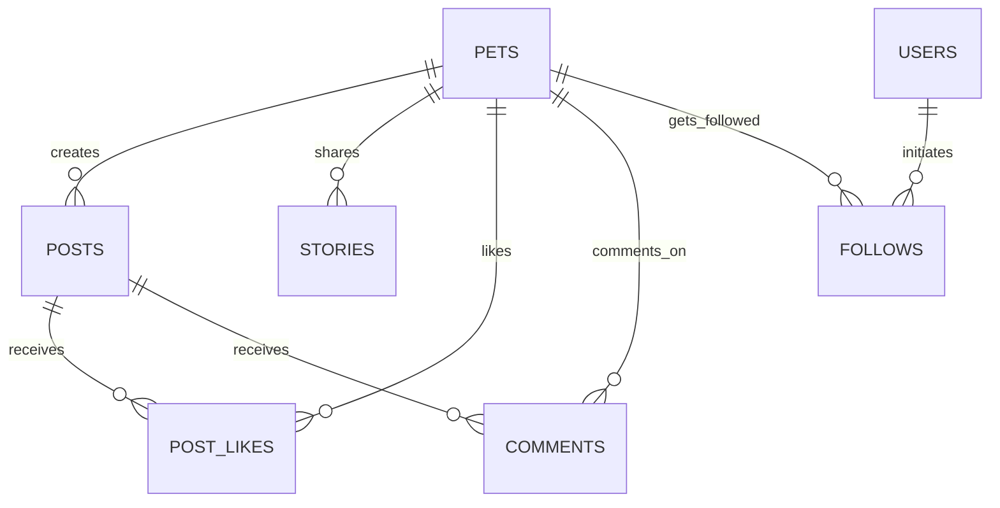
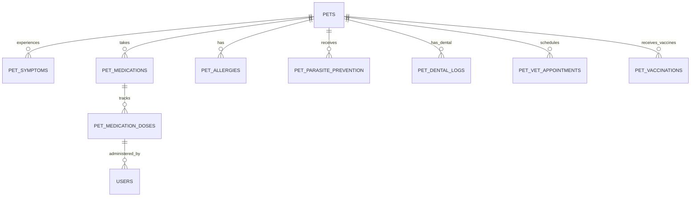
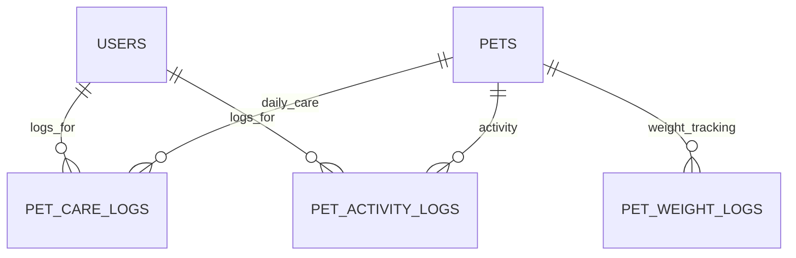
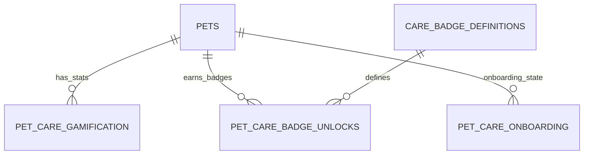
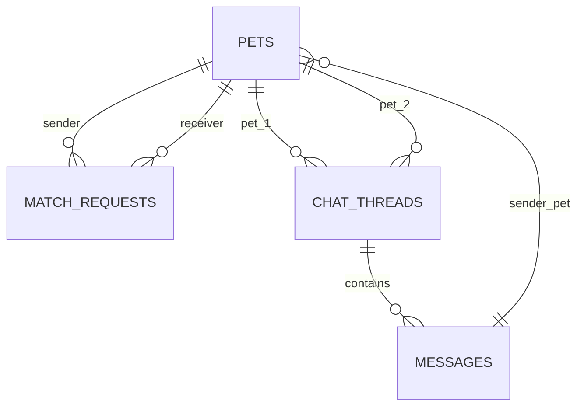
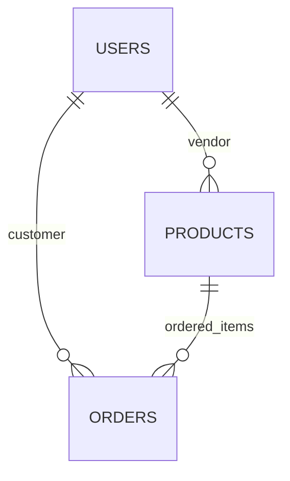

# PetSphere Entity Relationship Diagram (ERD)

## Complete Database Architecture Visualization

```mermaid
erDiagram
    USERS ||--o{ PROFILES : has
    USERS ||--o{ PETS : owns
    USERS ||--o{ NOTIFICATIONS : receives
    USERS ||--o{ ORDERS : places
    USERS ||--o{ PRODUCTS : sells
    USERS ||--o{ FOLLOWS : initiates
    USERS ||--o{ USER_FCM_TOKENS : registers
    USERS ||--o{ WAITLIST : joins
    
    PETS ||--o{ POSTS : creates
    PETS ||--o{ STORIES : shares
    PETS ||--o{ POST_LIKES : likes
    PETS ||--o{ COMMENTS : makes
    PETS ||--o{ MATCH_REQUESTS : sends
    PETS ||--o{ MATCH_REQUESTS : receives
    PETS ||--o{ CHAT_THREADS : participates_1
    PETS ||--o{ CHAT_THREADS : participates_2
    PETS ||--o{ MESSAGES : sends_message
    PETS ||--o{ FOLLOWS : gets_followed
    
    PETS ||--o{ PET_SYMPTOMS : experiences
    PETS ||--o{ PET_MEDICATIONS : takes
    PETS ||--o{ PET_MEDICATION_DOSES : records_dose
    PETS ||--o{ PET_ALLERGIES : has
    PETS ||--o{ PET_PARASITE_PREVENTION : receives_treatment
    PETS ||--o{ PET_DENTAL_LOGS : has_dental_care
    PETS ||--o{ PET_ACTIVITY_LOGS : logs_activity
    PETS ||--o{ PET_CARE_LOGS : daily_logs
    PETS ||--o{ PET_WEIGHT_LOGS : tracks_weight
    PETS ||--o{ PET_VET_APPOINTMENTS : schedules_with_vet
    PETS ||--o{ PET_VACCINATIONS : receives_vaccines
    PETS ||--o{ PET_CARE_GAMIFICATION : earns_points
    PETS ||--o{ PET_CARE_BADGE_UNLOCKS : unlocks_badges
    PETS ||--o{ PET_CARE_ONBOARDING : completes_onboarding
    
    POSTS ||--o{ POST_LIKES : receives
    POSTS ||--o{ COMMENTS : receives_comments
    
    CHAT_THREADS ||--o{ MESSAGES : contains
    
    CARE_BADGE_DEFINITIONS ||--o{ PET_CARE_BADGE_UNLOCKS : defines
    
    PET_MEDICATIONS ||--o{ PET_MEDICATION_DOSES : tracks
    
    USERS ||--o{ PET_SYMPTOMS : logged_by
    USERS ||--o{ PET_MEDICATIONS : prescribed_by
    USERS ||--o{ PET_MEDICATION_DOSES : administered_by
    USERS ||--o{ PET_ALLERGIES : documented_by
    USERS ||--o{ PET_PARASITE_PREVENTION : administered_by
    USERS ||--o{ PET_DENTAL_LOGS : logged_by
    USERS ||--o{ PET_ACTIVITY_LOGS : logged_by
    USERS ||--o{ STORIES : created_by
```



---

## Domain-Specific Views

### 1. Social & Engagement Domain



### 2. Health & Wellness Domain



### 3. Care Tracking Domain



### 4. Gamification Domain



### 5. Messaging & Matching Domain



### 6. Marketplace Domain



---

## Table Structure Summary

### High-Level Entity Groups

```
┌─────────────────────────────────────────────────────────────────┐
│                     AUTHENTICATION LAYER                         │
├─────────────────────────────────────────────────────────────────┤
│  auth.users → profiles                                          │
│  auth.users → user_fcm_tokens                                   │
│  auth.users → notifications                                      │
└─────────────────────────────────────────────────────────────────┘

┌─────────────────────────────────────────────────────────────────┐
│                        CORE ENTITY                               │
├─────────────────────────────────────────────────────────────────┤
│  PETS (central hub with 25+ relationships)                      │
│  ├── Owner: auth.users (FK: user_id)                            │
│  └── Created: with profile image, bio, breed, age, etc.         │
└─────────────────────────────────────────────────────────────────┘

┌─────────────────────────────────────────────────────────────────┐
│                    SOCIAL & ENGAGEMENT                           │
├─────────────────────────────────────────────────────────────────┤
│  posts         → pet-created posts                              │
│  ├── post_likes (pet ↔ post)                                     │
│  └── comments (pet → post)                                       │
│  stories       → 24-hour ephemeral content                      │
│  follows       → flexible follow (user→user or user→pet)        │
│  match_requests → pet↔pet bidirectional                         │
└─────────────────────────────────────────────────────────────────┘

┌─────────────────────────────────────────────────────────────────┐
│                  MESSAGING & COMMUNICATION                       │
├─────────────────────────────────────────────────────────────────┤
│  chat_threads  → between 2 pets                                  │
│  messages      → text/media messages in threads                 │
│  notifications → system alerts to users                         │
└─────────────────────────────────────────────────────────────────┘

┌─────────────────────────────────────────────────────────────────┐
│                   HEALTH & WELLNESS                              │
├─────────────────────────────────────────────────────────────────┤
│  pet_symptoms          → logged symptoms                         │
│  pet_medications       → prescriptions                           │
│  pet_medication_doses  → dose history                            │
│  pet_allergies         → allergen tracking                       │
│  pet_parasite_prevention → treatment schedule                    │
│  pet_dental_logs       → dental care records                     │
│  pet_vet_appointments  → vet scheduling                          │
│  pet_vaccinations      → vaccine tracking                        │
│  All logged by: auth.users (FK: user_id)                        │
└─────────────────────────────────────────────────────────────────┘

┌─────────────────────────────────────────────────────────────────┐
│                     CARE TRACKING                                │
├─────────────────────────────────────────────────────────────────┤
│  pet_care_logs        → daily feeding, water, tasks             │
│  pet_activity_logs    → exercise and activity                    │
│  pet_weight_logs      → weight monitoring                        │
│  Logged by: auth.users (specific health logs)                   │
└─────────────────────────────────────────────────────────────────┘

┌─────────────────────────────────────────────────────────────────┐
│                     GAMIFICATION                                 │
├─────────────────────────────────────────────────────────────────┤
│  care_badge_definitions    → 6 badge types                      │
│  pet_care_gamification     → stats/streaks                       │
│  pet_care_badge_unlocks    → achievement history                │
│  pet_care_onboarding       → setup completion                    │
└─────────────────────────────────────────────────────────────────┘

┌─────────────────────────────────────────────────────────────────┐
│                      MARKETPLACE                                 │
├─────────────────────────────────────────────────────────────────┤
│  products      → vendor listings (FK: vendor_id→auth.users)     │
│  orders        → customer purchases (FK: user_id→auth.users)    │
└─────────────────────────────────────────────────────────────────┘

┌─────────────────────────────────────────────────────────────────┐
│                   ADMINISTRATIVE                                 │
├─────────────────────────────────────────────────────────────────┤
│  waitlist      → email signup queue                              │
└─────────────────────────────────────────────────────────────────┘
```

---

## Foreign Key Relationships by Table

### PETS (26 inbound relationships)
```
pets ← posts           (1-to-many)
pets ← post_likes      (1-to-many)
pets ← comments        (1-to-many)
pets ← stories         (1-to-many)
pets ← match_requests  (2x, bidirectional: sender/receiver)
pets ← chat_threads    (2x, bidirectional: pet_id_1/pet_id_2)
pets ← messages        (1-to-many: sender_pet_id)
pets ← follows         (1-to-many: followed_pet_id)
pets ← pet_symptoms    (1-to-many)
pets ← pet_medications (1-to-many)
pets ← pet_medication_doses (1-to-many)
pets ← pet_allergies   (1-to-many)
pets ← pet_parasite_prevention (1-to-many)
pets ← pet_dental_logs (1-to-many)
pets ← pet_activity_logs (1-to-many)
pets ← pet_care_logs   (1-to-many)
pets ← pet_weight_logs (1-to-many)
pets ← pet_vet_appointments (1-to-many)
pets ← pet_vaccinations (1-to-many)
pets ← pet_care_gamification (1-to-1)
pets ← pet_care_badge_unlocks (1-to-many)
pets ← pet_care_onboarding (1-to-1)
```

### AUTH.USERS (10+ inbound relationships)
```
auth.users ← profiles  (1-to-1)
auth.users ← pets      (1-to-many: user_id/owner)
auth.users ← notifications (1-to-many)
auth.users ← follows   (1-to-many: follower_user_id)
auth.users ← follows   (1-to-many: followed_user_id)
auth.users ← orders    (1-to-many: user_id)
auth.users ← products  (1-to-many: vendor_id)
auth.users ← user_fcm_tokens (1-to-many)
auth.users ← pet_symptoms (many: user_id/logger)
auth.users ← pet_medications (many: user_id/prescriber)
auth.users ← ... (all health logs)
```

### POSTS (3 inbound relationships)
```
posts ← post_likes (1-to-many)
posts ← comments   (1-to-many)
posts ← pets       (via post creator)
```

### CARE_BADGE_DEFINITIONS (1 inbound relationship)
```
badge ← pet_care_badge_unlocks (1-to-many)
```

---

## Index Recommendations

### Primary Keys (Auto-Indexed)
All tables have primary keys and benefit from automatic indexing.

### Foreign Key Indexes (Should Exist)
```sql
-- Pet-related queries (HIGH PRIORITY)
CREATE INDEX idx_posts_pet_id ON posts(pet_id);
CREATE INDEX idx_comments_pet_id ON comments(pet_id);
CREATE INDEX idx_stories_pet_id ON stories(pet_id);
CREATE INDEX idx_match_requests_sender ON match_requests(sender_pet_id);
CREATE INDEX idx_match_requests_receiver ON match_requests(receiver_pet_id);
CREATE INDEX idx_chat_threads_pet1 ON chat_threads(pet_id_1);
CREATE INDEX idx_chat_threads_pet2 ON chat_threads(pet_id_2);

-- User-related queries
CREATE INDEX idx_notifications_user_id ON notifications(user_id);
CREATE INDEX idx_follows_follower ON follows(follower_user_id);
CREATE INDEX idx_follows_followed_user ON follows(followed_user_id);
CREATE INDEX idx_follows_followed_pet ON follows(followed_pet_id);

-- Order/Product queries
CREATE INDEX idx_orders_user_id ON orders(user_id);
CREATE INDEX idx_products_vendor_id ON products(vendor_id);

-- Health/Care queries (MEDIUM PRIORITY)
CREATE INDEX idx_pet_symptoms_pet_id ON pet_symptoms(pet_id);
CREATE INDEX idx_pet_medications_pet_id ON pet_medications(pet_id);
CREATE INDEX idx_pet_activity_logs_pet_id ON pet_activity_logs(pet_id);
CREATE INDEX idx_pet_care_logs_pet_id ON pet_care_logs(pet_id);
```

### Timestamp Indexes (For Range Queries)
```sql
CREATE INDEX idx_posts_created_at ON posts(created_at DESC);
CREATE INDEX idx_messages_created_at ON messages(created_at DESC);
CREATE INDEX idx_pet_care_logs_log_date ON pet_care_logs(log_date DESC);
CREATE INDEX idx_notifications_created_at ON notifications(created_at DESC);
```

---

## Data Volume Estimates

| Table | Rows (Small) | Rows (Medium) | Rows (Large) |
|-------|-------------|---------------|------------|
| pets | 100 | 10K | 100K |
| posts | 500 | 50K | 500K |
| messages | 1K | 100K | 1M |
| pet_care_logs | 365 per pet | 3.65K per pet | 36.5K per pet |
| comments | 100 | 10K | 100K |
| match_requests | 50 | 5K | 50K |

---

## Cascade & Delete Behavior

**Current Setup**: Most relationships are ON DELETE CASCADE via Supabase
- Deleting a pet cascades to: posts, stories, care logs, health records, etc.
- Deleting a user cascades to: their owned pets, notifications, orders

---

**Diagram Generated**: 2026-05-09  
**Format**: Mermaid ERD  
**Total Entities**: 30 tables  
**Total Relationships**: 75+ foreign keys
