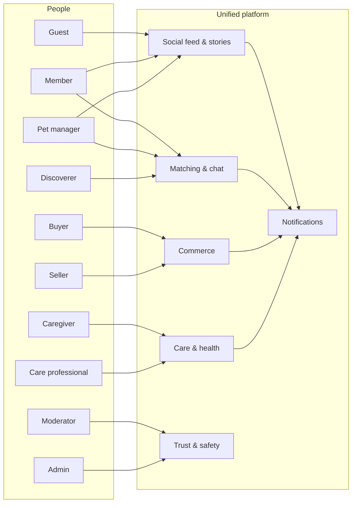
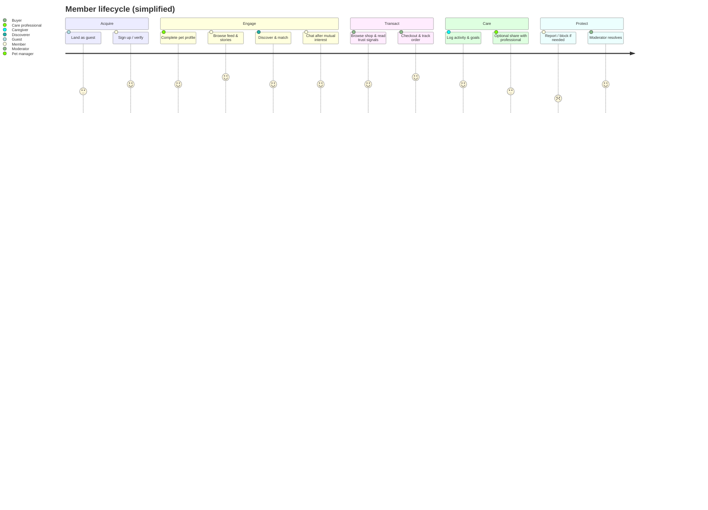
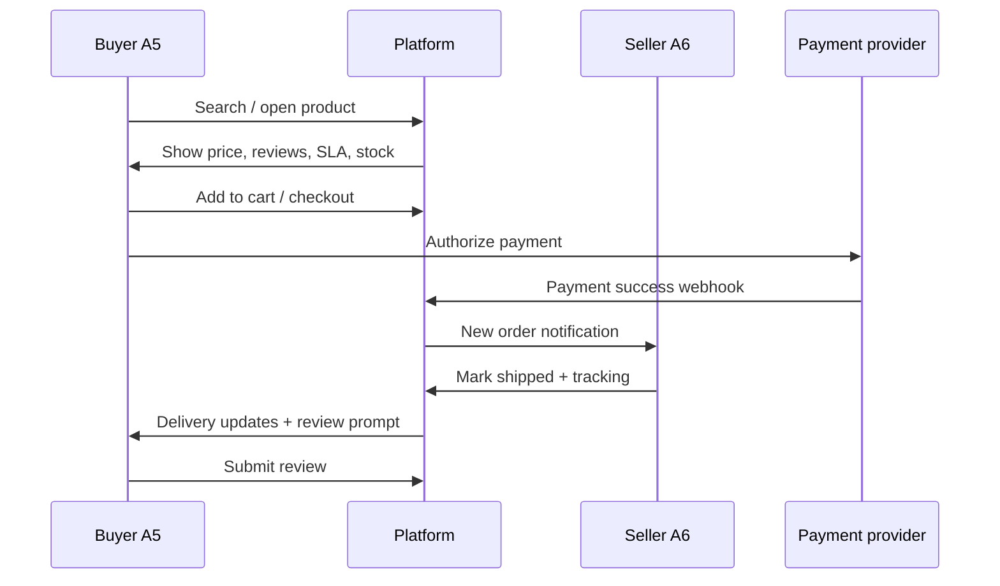
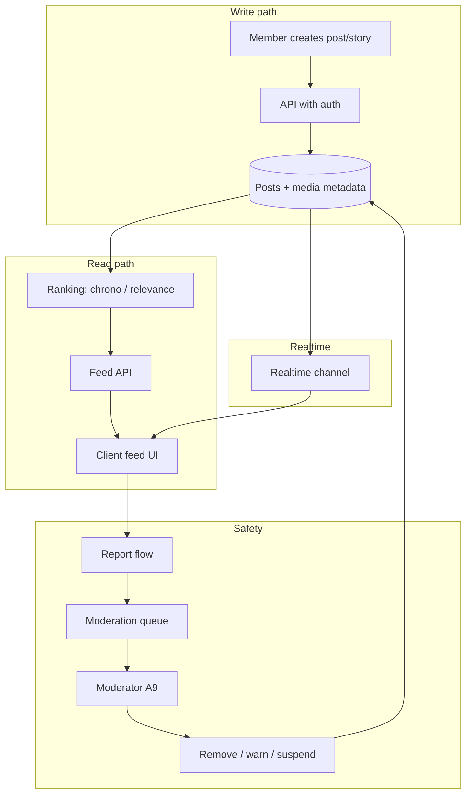
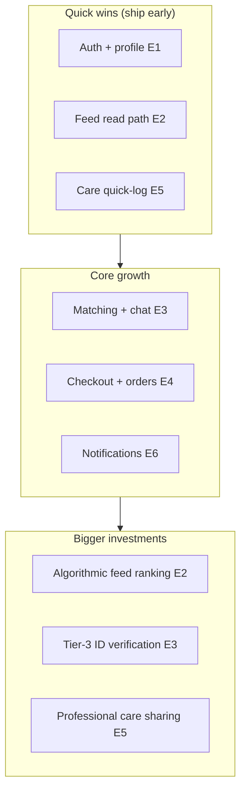

# User Stories & Actors: Social Feed, Matching, Commerce, and Care/Health Platform

**Document version:** 1.0  
**Date:** 2026-05-04  
**Scope:** Cross-industry best practices applied to a unified platform (e.g. pet-centric social + discovery + marketplace + care), suitable for backlog grooming and UX/engineering alignment.

---

## 1. Research summary (online sources)

Themes below synthesize publicly available guidance from product, UX, and systems literature. Use them as **non-binding** product input; legal/compliance (e.g. HIPAA for US PHI) requires professional review.

### 1.1 Social feed

| Theme | Practice | Representative sources |
|-------|-----------|-------------------------|
| Performance & scroll | Cursor-based pagination, list virtualization, prefetch/lazy media, target fast time-to-first meaningful item on mobile | [System Design Space – Instagram feed case](https://system-design.space/en/chapter/frontend-case-instagram-feed/), [Stream – scalable activity feed architecture](https://getstream.io/blog/scalable-activity-feed-architecture/) |
| Ranking | Start chronological; add relevance when enough engagement signals; balance recency + predicted engagement | [Design Gurus – social news feed](https://designgurus.io/blog/design-social-media-news-feed), [Stream – build a social media app](https://getstream.io/blog/build-a-social-media-app/) |
| Moderation | Layered sync/async moderation; clear policy taxonomy; avoid blocking legitimate UX | [Stream – scaling content moderation](https://getstream.io/blog/scaling-content-moderation/) |

### 1.2 Matching / discovery (dating-style patterns)

| Theme | Practice | Representative sources |
|-------|-----------|-------------------------|
| Trust & safety | Verification tiers, report/block within few taps, safety center, consent-first onboarding | [Boundev – safe dating app UX 2025](https://www.boundev.com/blog/safe-dating-app-ux-design-guide-2025), [Indent – MVP interactions & safety](https://indenttechnologies.com/post/dating-app-mvp-core-interactions-and-safety-measures/) |
| Discovery UX | Explainable filters, progressive profiling, profile strength nudges, icebreakers | [TapUI – dating app UI/UX](https://tapui.app/blog/design-dating-app-ai), [Lumestea – trends 2026](https://lumestea.com/blog/dating-app-ui-ux-trends-2026/) |
| Inclusion | Granular identity/preference controls, accessibility, community spaces | [AppsZetta – inclusive dating design](https://appszetta.com/inclusive-design-principles-for-modern-dating-apps/) |

### 1.3 Commerce / marketplace

| Theme | Practice | Representative sources |
|-------|-----------|-------------------------|
| Checkout | Minimize steps; sticky order summary; guest checkout; upfront shipping/tax; express wallets first on mobile | [NN/g – mobile checkout](https://www.nngroup.com/articles/mobile-checkout-ux/), [Baymard – checkout flow](https://baymard.com/learn/checkout-flow-ux-optimization), industry summaries citing abandonment drivers |
| Two-sided flows | Separate buyer/seller journeys; trust (reviews, SLAs, disputes) as first-class | [Dittofi – two-sided transaction flow](https://www.dittofi.com/learn/how-to-design-a-two-sided-marketplace-transaction-flow), [Sharetribe Academy](https://sharetribe.com/academy/how-to-describe-marketplace-to-a-developer) |
| Stories format | “As a … I need … so that …” + acceptance criteria | [Object Edge – eCommerce user story](https://www.objectedge.com/blog/writing-a-user-story-to-build-a-ecommerce-store) |

### 1.4 Care / health

| Theme | Practice | Representative sources |
|-------|-----------|-------------------------|
| Engagement | Device/integration where relevant, reminders, progressive disclosure, care-team messaging workflows | [MDPI – chronic disease app UX factors](https://www.mdpi.com/2227-9032/13/24/3272), [Vinta – CMS-aligned chronic care](https://www.vintasoftware.com/blog/building-cms-patient-apps) |
| UX foundation | Accessible navigation; core tasks obvious; reduce cognitive load | [Yeti – healthcare app UX](https://www.yeti.co/resources/healthcare-apps-guide-to-ux) |
| Compliance-oriented apps | Encrypt PHI in transit/at rest, MFA, least-privilege RBAC, audit logs, data minimization | [Accountable – medication app HIPAA practices](https://www.accountablehq.com/post/how-to-ensure-your-medication-adherence-app-is-hipaa-compliant-requirements-and-best-practices) |

### 1.5 Realtime / data layer (technical enabler)

Supabase **Realtime** listens to Postgres changes and can power live feeds, notifications, and chat—use alongside RLS for secure fan-out ([Supabase Realtime docs](https://supabase.com/docs/guides/realtime), surfaced via project `search_docs`).

---

## 2. Personas (user actors)

| Actor ID | Actor | Goal | Primary epics |
|----------|--------|------|----------------|
| **A1** | **Guest** | Understand value; sign up | Onboarding, marketing surfaces |
| **A2** | **Registered member** | Build identity, follow content, stay safe | Profile, social feed, safety |
| **A3** | **Pet profile manager** (often same as A2) | Represent pets accurately | Profiles, media, privacy |
| **A4** | **Discoverer / matcher** | Find compatible pets/people | Discovery, matching, chat |
| **A5** | **Buyer** | Purchase pet products confidently | Catalog, cart, checkout, orders |
| **A6** | **Seller / merchant** | List, fulfill, grow reputation | Listings, inventory, payouts, support |
| **A7** | **Caregiver** | Log care, track goals, stay consistent | Care logs, goals, reminders |
| **A8** | **Care professional** (optional) | Review shared data, coordinate (non-diagnostic in-app unless licensed) | Shared views, messaging, compliance |
| **A9** | **Moderator** | Enforce policy, triage reports | Moderation queue, actions |
| **A10** | **Platform admin** | Configure policies, feature flags, catalog governance | Admin, analytics, fraud rules |
| **A11** | **System / automation** | Notify, score, route, expire content | Jobs, push, recommendations |

**Notes**

- **A8** scope must match your regulatory model; many apps stay “wellness/lifestyle” until proper clinical agreements exist.  
- **A6** may be internal (first-party store) or external (third-party sellers)—permissions differ.

---

## 3. Diagrams

### 3.1 Actor–subsystem map (C4-style context)

### 3.2 High-level journey (happy paths)

### 3.3 Marketplace transaction (two-sided)

### 3.4 Feed + moderation data flow (conceptual)

---

## 4. Epics and user stories

**Story template:** `As a <actor>, I want <capability>, so that <outcome>.`  
**Acceptance criteria (AC):** bullet list per story.

---

### Epic E1 — Onboarding, account, and identity

| ID | Story | AC |
|----|--------|-----|
| **US-E1-01** | As a **Guest (A1)**, I want to browse a limited marketing feed and value props, so that I understand the community before signing up. | Public content only; no PII; CTA to register visible; rate-limit anonymous API if applicable. |
| **US-E1-02** | As a **Member (A2)**, I want email/phone/social sign-in with optional MFA, so that my account is protected. | Auth flows complete; session recovery; MFA optional but encouraged for high-risk actions. |
| **US-E1-03** | As a **Member (A2)**, I want progressive onboarding (skip non-critical steps), so that I reach the main shell quickly. | Critical path under N steps; “finish profile later” path; progress meter optional. |
| **US-E1-04** | As a **Pet profile manager (A3)**, I want to create multiple pet profiles with photos and traits, so that matching and feed personalization are accurate. | CRUD pets; media upload with validation; species/breed/age fields as product defines. |

---

### Epic E2 — Social feed & stories

| ID | Story | AC |
|----|--------|-----|
| **US-E2-01** | As a **Member (A2)**, I want a home feed that loads quickly with skeleton states, so that I do not bounce on slow networks. | Cursor pagination; TTFM target met on 4G profile; pull-to-refresh; empty state. |
| **US-E2-02** | As a **Member (A2)**, I want to switch between chronological and “for you” ranking when offered, so that I control how I discover content. | Toggle persisted; explain ranking simply; fallback to chrono if low signals. |
| **US-E2-03** | As a **Member (A2)**, I want to create posts with text and media, so that I can share updates about my pets. | Draft support optional; compression; abuse filter pre-publish where applicable. |
| **US-E2-04** | As a **Member (A2)**, I want ephemeral stories with expiry, so that I can share lightweight moments. | Auto-expire; privacy selector (followers/public); report entry point. |
| **US-E2-05** | As a **Member (A2)**, I want to react and comment with realtime updates, so that conversations feel live. | Optimistic UI with rollback; Realtime or polling strategy defined; spam throttles. |
| **US-E2-06** | As a **Member (A2)**, I want to follow/unfollow creators, so that my feed reflects my interests. | Idempotent follow; mutual block respected in feed query. |
| **US-E2-07** | As a **Moderator (A9)**, I want a queue of reported content with context, so that I can enforce policy consistently. | Report reasons taxonomy; deep link to content; audit log of actions. |

---

### Epic E3 — Discovery, matching, and messaging

| ID | Story | AC |
|----|--------|-----|
| **US-E3-01** | As a **Discoverer (A4)**, I want filters (distance, species, intent), so that I only see relevant profiles. | Filters persist; explain “why you see this”; zero results state. |
| **US-E3-02** | As a **Discoverer (A4)**, I want a swipe/card deck with instant photo load, so that decisions feel effortless. | Prefetch next cards; undo optional; accessibility alternative to swipe. |
| **US-E3-03** | As a **Discoverer (A4)**, I want to send a match request or like with clear mutual consent rules, so that harassment is reduced. | Mutual match opens chat; one-sided limits per day configurable. |
| **US-E3-04** | As a **Member (A2)**, I want in-app chat with read receipts optional, so that I can coordinate meetups safely. | Block stops all channels; link warnings; attachment virus scan policy. |
| **US-E3-05** | As a **Member (A2)**, I want icebreaker suggestions based on profile overlap, so that first messages are higher quality. | At least 3 prompts; user can dismiss; no PII leakage from prompts. |
| **US-E3-06** | As a **Member (A2)**, I want to block and report within two taps from profile/chat, so that I feel safe. | Block immediate effect; report categories; confirmation UX. |
| **US-E3-07** | As a **Member (A2)**, I want optional verification (photo, ID tiered), so that trust signals are visible on profiles. | Badges per tier; downgrade path if verification fails; privacy policy. |

---

### Epic E4 — Commerce (catalog → cart → post-purchase)

| ID | Story | AC |
|----|--------|-----|
| **US-E4-01** | As a **Buyer (A5)**, I want search, facets, and trustworthy product detail (reviews, shipping estimate), so that I can decide without leaving the PDP. | Stock status; seller badge; return SLA snippet; image zoom. |
| **US-E4-02** | As a **Buyer (A5)**, I want a cart that supports quantity, variants, and promos with live totals, so that I am not surprised at checkout. | Tax/shipping estimate before pay; promo errors human-readable. |
| **US-E4-03** | As a **Buyer (A5)**, I want guest checkout with account creation after purchase, so that I am not forced to register mid-flow. | Guest path completes order; post-purchase account offer. |
| **US-E4-04** | As a **Buyer (A5)**, I want express payment options on mobile when available, so that checkout completes in minimal taps. | Apple/Google/Shop Pay surfaced per device; fallback card form. |
| **US-E4-05** | As a **Buyer (A5)**, I want order tracking and notifications, so that I know shipment status. | States: placed → shipped → delivered; push/email preferences respected. |
| **US-E4-06** | As a **Seller (A6)**, I want to onboard as a merchant with payout and tax collection steps, so that I can legally sell. | KYC as required by jurisdiction; payout status visible. |
| **US-E4-07** | As a **Seller (A6)**, I want to create/edit listings with inventory and variants, so that buyers see accurate availability. | Out-of-stock prevents purchase; bulk edit optional. |
| **US-E4-08** | As a **Seller (A6)**, I want to fulfill orders and print/publish tracking, so that buyers receive goods predictably. | Partial fulfillments policy; cancellation rules. |
| **US-E4-09** | As a **Buyer (A5)**, I want disputes/returns initiated in-app, so that issues are resolved fairly. | SLA timers; moderator/admin escalation path. |
| **US-E4-10** | As **Admin (A10)**, I want to feature/de-list products and manage categories, so that the catalog stays high quality. | Audit trail; reason codes; cache busting for feed tiles. |

---

### Epic E5 — Care, health, and wellness tracking

| ID | Story | AC |
|----|--------|-----|
| **US-E5-01** | As a **Caregiver (A7)**, I want quick-log actions (feed, walk, meds) with timestamps, so that daily care is captured with low friction. | Defaults from last entry; offline queue optional. |
| **US-E5-02** | As a **Caregiver (A7)**, I want goals and streaks with humane reminders, so that I stay motivated without shame. | Snooze; frequency caps; clear data ownership statement. |
| **US-E5-03** | As a **Caregiver (A7)**, I want to attach notes or vitals to a pet timeline, so that I can spot trends over time. | Charts respect accessibility; export optional per policy. |
| **US-E5-04** | As a **Care professional (A8)**, I want read-only (or agreed) access to shared care logs, so that I can coordinate without unsafe diagnostics in-app. | Consent log; scope limited to selected pets/time window; no auto “diagnosis” copy unless licensed workflow. |
| **US-E5-05** | As a **Member (A2)**, I want to control what care data appears on social vs private, so that privacy boundaries are clear. | Per-field visibility; preview as other users see. |
| **US-E5-06** | As **Admin (A10)**, I want retention and export policies configurable, so that regulated markets can be supported later. | Data export; delete account cascade documented. |

---

### Epic E6 — Notifications, growth, and platform integrity

| ID | Story | AC |
|----|--------|-----|
| **US-E6-01** | As a **Member (A2)**, I want granular notification preferences per channel (push/email/in-app), so that I am not spammed. | OS permission prompts contextual; quiet hours optional. |
| **US-E6-02** | As **System (A11)**, I want to generate digest notifications for non-urgent events, so that users batch noise. | Digest frequency configurable; urgent bypass (order shipped, safety). |
| **US-E6-03** | As **Admin (A10)**, I want fraud signals (velocity, chargebacks) surfaced, so that marketplace abuse is mitigated. | Rules engine hooks; manual review queue. |

---

### Epic E7 — Cross-cutting accessibility & internationalization

| ID | Story | AC |
|----|--------|-----|
| **US-E7-01** | As a **Member (A2)** using assistive tech, I want all primary flows keyboard/screen-reader reachable, so that I can use the app independently. | WCAG-oriented checklist on feed, checkout, care log flows. |
| **US-E7-02** | As a **Member (A2)**, I want localized formats and content rules, so that dates/currency match my locale. | i18n strategy; moderation respects locale-specific norms where applicable. |

---

## 5. Story map (example priority lanes)

Illustrative grouping for roadmap conversation (not precise scoring). Wider Mermaid support than `quadrantChart`.

---

## 6. Traceability matrix (sample)

| Business theme | Research anchor | Epics |
|------------------|-----------------|-------|
| Feed performance | Virtualized lists, cursor paging | E2 |
| Moderation | Layered moderation | E2, E6 |
| Matching safety | Report/block, verification | E3 |
| Checkout trust | Guest checkout, upfront costs | E4 |
| Care engagement | Reminders, progressive disclosure | E5 |

---

## 7. Next steps for product/engineering

1. **Prioritize epics** E1 → E2 → E4 (or E3 first if matching is the wedge).  
2. **Attach metrics** per epic (activation, D7 retention, GMV, care log completion rate, report rate).  
3. **Decompose** each US into technical tasks (API, RLS policies, UI, analytics).  
4. **Compliance review** for E5/E8 before promising clinical workflows.

---

## 8. References (URLs)

- Feed architecture & moderation: [getstream.io/blog/scalable-activity-feed-architecture](https://getstream.io/blog/scalable-activity-feed-architecture/), [getstream.io/blog/scaling-content-moderation](https://getstream.io/blog/scaling-content-moderation/), [designgurus.io/blog/design-social-media-news-feed](https://designgurus.io/blog/design-social-media-news-feed), [system-design.space – Instagram feed frontend case](https://system-design.space/en/chapter/frontend-case-instagram-feed/)  
- Matching / safety / UX: [boundev.com/blog/safe-dating-app-ux-design-guide-2025](https://www.boundev.com/blog/safe-dating-app-ux-design-guide-2025), [indenttechnologies.com/post/dating-app-mvp-core-interactions-and-safety-measures](https://indenttechnologies.com/post/dating-app-mvp-core-interactions-and-safety-measures/), [tapui.app/blog/design-dating-app-ai](https://tapui.app/blog/design-dating-app-ai), [appszetta.com/inclusive-design-principles-for-modern-dating-apps](https://appszetta.com/inclusive-design-principles-for-modern-dating-apps/)  
- Commerce: [nngroup.com/articles/mobile-checkout-ux](https://www.nngroup.com/articles/mobile-checkout-ux/), [baymard.com/learn/checkout-flow-ux-optimization](https://baymard.com/learn/checkout-flow-ux-optimization), [dittofi.com/learn/how-to-design-a-two-sided-marketplace-transaction-flow](https://www.dittofi.com/learn/how-to-design-a-two-sided-marketplace-transaction-flow), [sharetribe.com/academy/how-to-describe-marketplace-to-a-developer](https://sharetribe.com/academy/how-to-describe-marketplace-to-a-developer)  
- Health / engagement / HIPAA-oriented: [mdpi.com/2227-9032/13/24/3272](https://www.mdpi.com/2227-9032/13/24/3272), [yeti.co/resources/healthcare-apps-guide-to-ux](https://www.yeti.co/resources/healthcare-apps-guide-to-ux), [vintasoftware.com/blog/building-cms-patient-apps](https://www.vintasoftware.com/blog/building-cms-patient-apps), [accountablehq.com/post/how-to-ensure-your-medication-adherence-app-is-hipaa-compliant-requirements-and-best-practices](https://www.accountablehq.com/post/how-to-ensure-your-medication-adherence-app-is-hipaa-compliant-requirements-and-best-practices)  
- Realtime: [supabase.com/docs/guides/realtime](https://supabase.com/docs/guides/realtime)

---

**MCP & methods used:** Web search (multiple queries), Supabase MCP `search_docs` (Realtime/feeds alignment), internal skills context (layered architecture, mobile UX, two-sided marketplace patterns). Diagrams use **Mermaid** (GitHub, many IDEs, and Markdown previewers render `mermaid` code fences).
